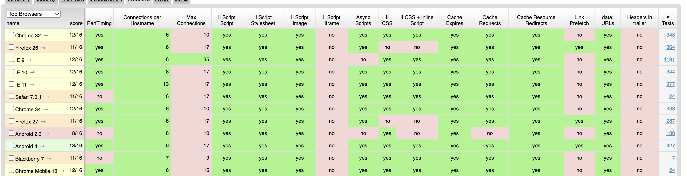
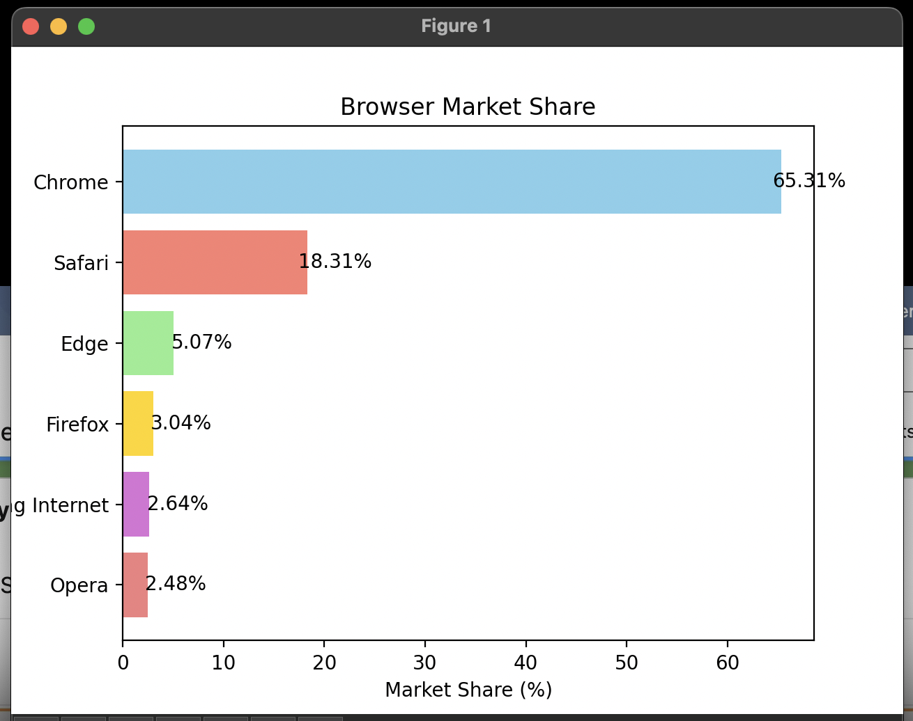

## What is blocking

- We limit on the number of parallel connections that a browser can make to the same host. (6)
-  So limit on the number of connections per host will range anywhere from 2 to 13, with a maximum number of connections ranging up to 60.
- The number of connections available within a browser is directly responsible for what is commonly referred to as blocking, or stalling.

Blocking occurs when a file is forced to wait on connections to free up before it can begin to download to the browser. Files essentially line up in queue and wait for a connection to the server to free up before they can become accessible to site users.

### Why blocking happens

When there are more files needing to load than connections available, it is inevitable that blocking will occur.

- Once your page’s HTML loads, all of the CSS, JavaScript, images, and other files will begin to download from the server so these elements can be displayed in your browser. Unless instructed otherwise, these files will load synchronously - in the order in which they appear in your site’s code
- When a browser has reached its limit on connections available, the additional files that have requested to be loaded are **forced to wait** until another connection becomes available.

### Use case
- Imagine that you have 12 files (CSS, JS, images, etc.) loading synchronously on your site and they are all coming from the same host.

- In Chrome, the first 6 will begin downloading while the next 6 are forced to wait. These remaining 6 files will then begin to download as the connections become available.
- If all 6 files happen to finish downloading at the same time, the connections will all free up and the proceeding files will start downloading immediately. 
-  However, this is almost always not the case. Usually, only one connection frees up at a time. Despite constant performance improvements, browsers can only handle a set number of requests at one time. 
- You may have noticed that opening more tabs declines overall page response time. This is because the same connection limitations still exist, no matter how many tabs are open

|Browser|# parallel connections to a single host|Max. connections|Notes|
|---|---|---|---|
|Chrome|6|10|Chrome can handle 6 requests at a time coming from the same host, and will handle 4 more coming from another host at the same time|
|Firefox|6|17|Firefox can handle up to 17 connections|

## How to tackle blocking

- While it may appear that having more connections available would greatly increase browser (and web) performance, this can put a lot of strain on the server.
-  If your browser could handle 60 connections instead of 6, the server could potentially handle a mere 10% of traffic. 
- There are some browsers out there that allow you to increase the number of connections available (Opera, IE10, 11, & 12), but it is generally inadvisable to increase the number of connections unless you are performing a load test on your server. Not only will increased connections mess with your server’s performance, the server could potentially treat you as a DDoS attack.

- Keep a balance between the front end and back end to optimize browsing experience. You can also consider loading files asynchronously or through Ajax calls. Your can even choose the order in which files are loaded. So if a certain image provides more value to a page than your customer reviews, consider loading it first.

## Browser popularity Feb 2024

| Browser          | Market share (global) |
|------------------|-----------------------|
| Chrome           | 65.31%                |
| Safari           | 18.31%                |
| Edge             | 5.07%                 |
| Firefox          | 3.04%                 |
| Samsung Internet | 2.64%                 |
| Opera            | 2.48%                 |

## References
- [Blocking: The Web Performance Villain](https://bluetriangle.com/blog/blocking-web-performance-villain)
- [chromium code](https://source.chromium.org/chromium/chromium/src/+/main:net/socket/client_socket_pool_manager.cc)
- [Roundup on Parallel Connections](https://www.stevesouders.com/blog/2008/03/20/roundup-on-parallel-connections/)
- [Browserscope](https://web.archive.org/web/20160209092324/http://www.browserscope.org/?category=network)
- [Webkit](https://github.com/WebKit/WebKit)
- [Google Chrome Breaks Up With Apple's WebKit](https://www.wired.com/2013/04/blink/)
- [Blink](https://www.chromium.org/blink/)
    - [Blink Code - Google git](https://chromium.googlesource.com/chromium/src/+/HEAD/third_party/blink/)
    - [Blink: A rendering engine for the Chromium project](https://blog.chromium.org/2013/04/blink-rendering-engine-for-chromium.html)
    - [KHTML](https://en.wikipedia.org/wiki/KHTML)
    - [How Blink works](https://docs.google.com/document/d/1aitSOucL0VHZa9Z2vbRJSyAIsAz24kX8LFByQ5xQnUg/edit#heading=h.v5plba74lfde)

- [Chromium's  Multi-process Architecture ](https://www.chromium.org/developers/design-documents/multi-process-architecture/)
- [Chrome Platform status](https://chromestatus.com/roadmap)
- [Browser market share](https://www.oberlo.com/statistics/browser-market-share)